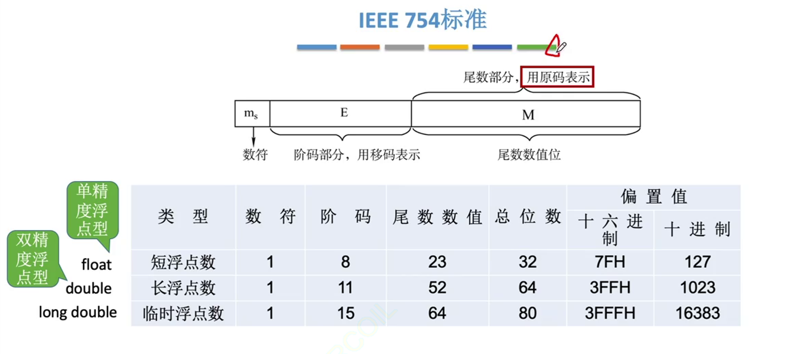
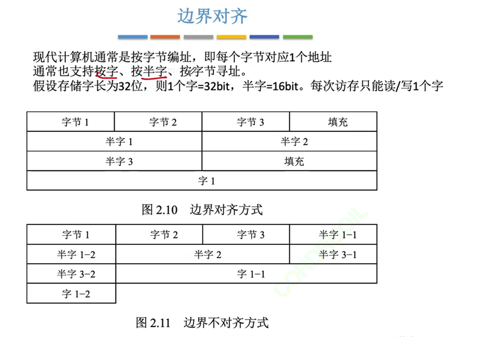

## 1. 浮点数的表示

### 1. 浮点数的表示格式
定点数有时候无法表示极大数，其可表示的数字范围有限，又不能无限制地增加数据的长度

浮点数的思想和科学计数法差不多！

阶码：常用==补码或移码==表示的顶点整数

尾数：常用==原码或补码==表示的定点小数

| 阶符 | ==阶码==的数值部分 | 数符 | ==尾数==的数值部分 |
| :---: | :---: | :---: | :---: |
| $J_r$ | $J_1 J_2 ... J_m$ | $S_r$ | $S_1 S_2...S_n$ |

通常，浮点数的真值表示为

$$N=r^E×M$$

r: 阶码的底，通常为2

E：阶码，反映了浮点数的表示范围及小数点的实际位置，指明了小数点要往前/往后移动几位

M：尾数，给出一个小数，其位数反映了浮点数的精度

### 2. 浮点数的规格化

规格化，即尾数的数值部分最高位一定是1，需要进行左右规来调整尾数

| 操作 | 操作结果 | 操作的原因 |
| --- | ---- | --- |
| 左规 | 阶码-1 | 数值部分最高位为0，不足，需要增大尾数的数值部分 |
| 右规 | 阶码+1 | 尾数部分发生了溢出，需要减少尾数部分 |

:::tip
采用双符号位，当发生溢出时，可以挽救。更高的符号位才是正确的符号位

对负数补码进行规格化的步骤就是算术左移右移！回顾上一节！
:::

==规格化浮点数的特点==

1. 以原码表示的尾数进行规格化：

| 尾数的最值 | 真值 | 二进制表示 |
| --- | ---- | ------- |
| 正数最大值 | $(1-2^{-n})$ | $0.111...1$ |
| 正数最小值 | $\frac 12$ | $0.100...0$ |
| 负数最大值 | $-\frac 12$ | $1.100...0$ |
| 负数最小值 | $-(1-2^{-n})$ | $1.111...1$ |

2. 以补码表示的尾数进行规格化

| 尾数的最值 | 真值 | 二进制表示 |
| --- | ---- | ------- |
| 正数最大值 | $(1-2^{-n})$ | $0.111...1$ |
| 正数最小值 | $\frac 12$ | $0.100...0$ |
| 负数最大值 | $-(1/2+2^{-n})$ | $1.011...1$ |
| 负数最小值 | $-1$ | $1.000...0$ |

:::tip
以补码表示的规格化尾数，其符号位和最高数值位必须是不同的数值

即，正数补码尾数最高数值位一定是1,

负数补码尾数最高数值位一定是0
:::

### 3. 浮点数标准 IEEE 754

IEEE标准中，指数(阶码)部分是以移码表示的

32位单精度浮点数的格式如下：

| 符号 | n位 阶码 | 尾数数值位 |
| --- | --- | --- |
| 1位 | 8位，用==移码==来表示，移码的偏置值设为$2^{n-1}-1$ | 23位，用==原码==来表示|

:::tip 隐藏数值位
对于规格化的二进制浮点数，尾数的最高位总是1

为了使尾数能多表示1位数值位，因此将这个1隐藏，称为<u>隐藏位</u>

因此23为尾数实际上表示了24位有效数字

例如：$(12)_{10}=(1100)_2$，将其规格化的结果是$\color{red}{1}.1×2^3$，其中整数部分的1将不存储在23位尾数内
:::

:::tip
==阶码真值=移码-偏移量==

可以先把移码看成十进制，然后再减去偏移量，比较快出结果而且不容易出错

:::

例子：将$-0.75_{10}$转换为IEEE 754的单精度浮点数格式表示

$$(-0.75)_{10}=(-0.11)_2=(-1.1)_2×2^{-1}$$

数符=$\color{red}{1}$(负数)

尾数部分：$\color{green}{10000...}$(已隐含最高位1)

阶码真值：-1

单精度浮点型偏移量：127D

移码=阶码真值+偏移量=-1+111 1111=$\color{blue}{0111 1110}$(凑足8位)

所以阶码就是：

$$\color{red}{1}\color{blue}{011\space1111\space0}\color{green}{100\space0000\space0....}$$

单精度浮点型能表示的范围：

| 尾数的最值 | 整体真值 | 阶码真值| 尾数真值 | 二进制表示 |
| --- | ---- | ------- | --- | --- |
| 最小绝对值 | $2^{-126}$ | -126 | 0 | $\color{red}{0}\color{blue}{000\space0000\space1}\color{green}{000\space0000\space0....}$ |
| 最大绝对值 | $(2-2^{-23})×2^{127}$ | 127 | $2-2^{-23}$ | $\color{red}{0}\color{blue}{111\space1111\space0}\color{green}{111\space1111\space1....}$

:::tip
IEEE标准中，阶码全1和全0用作特殊用途

所以8位阶码的真值的正常范围为-126\~127

+ 若阶码全为0，且尾数M不全为0，则称为<u>非规格化小数</u>：$\pm(0.\text{xx...x})_2×2^{-126}$

此时隐含最高位变为0，阶码真值固定为-126

+ 若阶码全为0，尾数M全为0，则表示<u>真值</u>：$\pm 0$

+ 若阶码全为1，尾数M全为0，则表示<u>无穷大</u>：$\pm\infty$

+ 若阶码全为1，尾数M不全为0，则表示<u>非数值</u>："NaN"(非法运算)
:::

## 2. 浮点数的加减运算

步骤：
### 0. 真值转换到机器数

### 1. 对阶

小阶向大阶靠齐

对阶可能导致丢失末位精度，即产生舍入操作

==注意：只有尾数右移的对阶==

### 2. 尾数加减

通常使用双符号位来表示尾数，来减轻尾数溢出的影响

在进行尾数加减运算时，需要将IEEE 754的隐藏位还原到尾数部分参与运算，因为运算后的尾数不一定是规格化的

### 3. 规格化

在隐藏位参与运算后，若尾数最高数值位为无效位时，尾数左移，阶码减1

尾数双符号位不同时，尾数右移，阶码加1

### 4. 舍入 

如果规定只能保留x位有效尾数，则多余部分直接砍掉

或者，如果砍掉的部分最高位非0，则往前入1

或者，不管丢掉的最高数值位是多少，右移后的位数末位恒置1

==只有浮点数才需要舍入==

### 5. 判溢出 
若规定阶码不能超过x位，则运算后若阶码超出范围，则溢出

:::tip
当真值小于最小绝对值时，称为正下溢或负下溢，此时视作机器数0

当真值大于最大绝对值时，称为正上溢或负上溢，此时抛出异常
:::

注：尾数溢出未必导致整体溢出，也许可以通过3、4步来拯救

## 3. 浮点数的强制类型转换

在32位机器下，以char→int→long→double和float→double的类型转换的范围和精度从小到大，没有损失

int→float：可能损失精度

float→int：可能溢出及损失精度

int：表示整数，范围$-2^{31}\sim 2^{31}-1$，有效数字32位

float：表示整数及小数，范围$\pm[2^{-126}\sim2^{127}×(2-2^{-23})]$，有效数字23+1=24位

## 4. 数据的存储和排列

### 1. 大小端
多字节数据在内存里一定是占连续的几个字节

大端存储方式：高位有效字节存储在低位地址中，字中的字节顺序与原序列相同

小端存储方式：高位有效字节存储在高位地址中，字中的字节顺序与原序列相反

### 2. 边界对齐

边界对齐是一种空间换时间的方式，如果一个字/半字存储在了不同的地址，则需要访问多个地址

:::tip
对于32位计算机来说，一个字有4字节

通常，int有32位，4字节

short有16位，2字节

char有8位，1字节
:::

