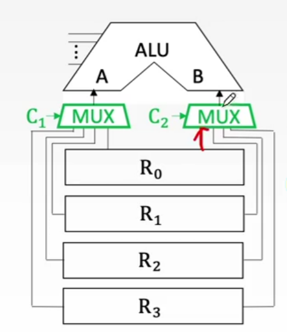
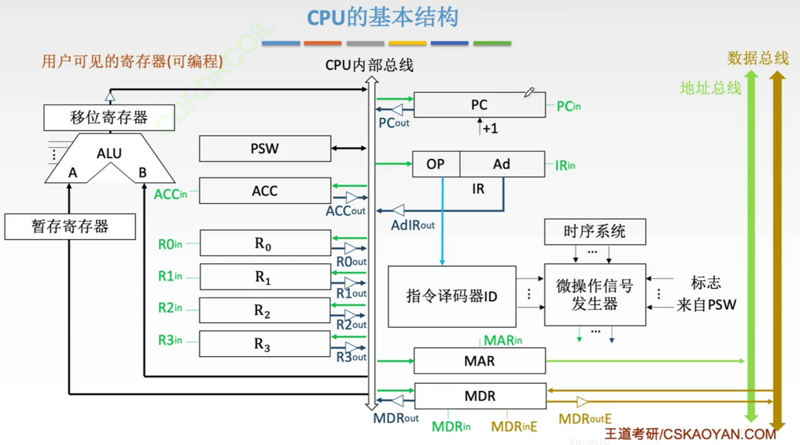

CPU包括了运算器和控制器

## 1. CPU的功能

1. 指令控制

完成取指令、分析指令和执行指令的操作，即程序的顺序控制

2. 操作控制

一条指令的功能往往是由若干操作信号的组合来实现的。CPU管理并产生由内存取出的每条指令的操作信号，把各种操作信号送往对应的部件，从而控制这些部件按指令的要求进行动作

3. 时间控制

对各种操作加以时间上的控制。时间控制要为每条指令按时间顺序提供应有的控制信号

4. 数据加工

对数据进行算术和逻辑运算

5. 中断处理

对计算机运行过程中的异常情况和特殊请求进行处理

## 2. 运算器和控制器的功能

运算器：对数据进行加工

控制器：取指令、分析指令、执行指令、中断处理

### 2.1 运算器的基本结构

1. 算术逻辑单元ALU：主要进行算术/逻辑运算
2. 通用寄存器组，如AX、BX、DC、SP等，用于存放操作数和各种地址信息等
3. 暂存寄存器：用于暂存从主存读出的数据，这个数据不能存放在通用寄存器中，否则会破坏其原有内容
4. 累加寄存器：用于暂时存放ALU运算的结果信息
5. 程序状态字寄存器，保存由算术逻辑运算指令或测试指令的结果而建立的各种状态信息，如OF，SF，ZF，CF。PSW中的这些位参与并决定微操作的形成
6. 移位器：对运算结果进行移位运算
7. 计数器：控制乘除运算的操作步数

SP是堆栈指针

### 2.1.1 数据通路的基本结构
专用数据通路：根据指令执行过程中的数据和地址流动方向安排连接线路

如果直接用导线链接，相当于多个寄存器同时并且一直向ALU传输数据

解决方法1：使用多路选择器根据控制信号选择一路输出

解决方法2：使用三态门控制每一路是否输出 

性能较高，基本不存在数据冲突现象；但结构复杂，硬件量大，不易实现

CPU内部单总线方式：将所有寄存器的输入端和输出端都连接到一条公共的通路上

结构简单，容易实现；但数据传输存在较多冲突现象，性能较低

### 2.2 控制器的基本结构

1. 程序计数器：用于指出下一条指令在主存中的存放地址，有自增功能
2. 指令寄存器：用于保存当前正在执行的指令
3. 指令译码器：仅对操作码字段进行译码，向控制器提供特定的操作信号
4. 微操作信号发生器：根据IR的内容、PSW的内容及时序信号，产生控制整个计算机系统所需的各种控制信号
5. 时序系统：用于产生各种时序信号，它们都是由统一时钟分频2得到

