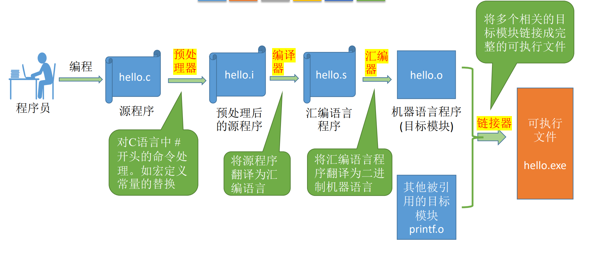
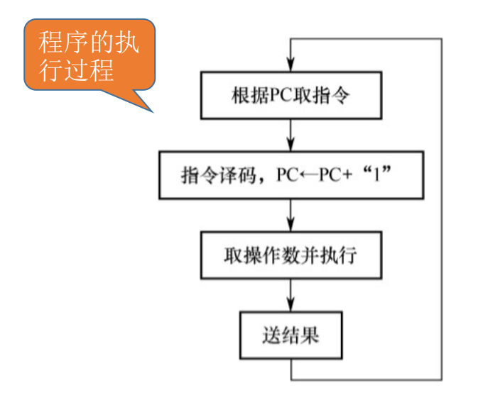

## 1. 计算机系统的组成

**硬件系统**和**软件系统**共同构成了一个完整的计算机系统

冯诺依曼机包含：

+ 输入设备：将信息转换为机器能识别的形式
+ 输出设备：将结果转换为人们熟悉的形式
+ 存储器：存放数据与程序
+ 运算器：进行逻辑运算与算术运算
+ 控制器：指挥程序运行

输入设备→运算器←→存储器

运算器→输出设备

存储器→控制器

:::tip
在计算机系统中，软件和硬件在逻辑上时等效的
:::

冯诺依曼计算机的特点：

1. 计算机由五大部件组成
2. 指令和数据以同等地位存于存储器中，可以按照地址寻访
3. 指令和数据都用二进制表示
4. 指令由操作码和地址码组成
5. 存储程序
6. 以运算器为中心

操作码：指示应该执行加或减或...的操作

地址码：指示结果应当被存储在何处

存储程序：将指令以二进制代码的形式，事先输入计算机的主存储器，然后按照其在存储器中的首地址执行程序的第一条指令，以后就按照该程序的规定顺序执行其他指令，直到程序执行结束

现代计算机：==以存储器为中心==

CPU=运算器+控制器

主机：主存+CPU

IO设备：辅存+输入输出设备

主存就是运行内存，辅存就是储蓄内存

## 2. 计算机的功能部件

### 1. 主存储器

主存储器的基本组成

存储体：用于存储数据的元件

MAR：存储地址寄存器，通过地址在存储体内找到数据后存放在MDR上

MAR的位数反映存储单元的个数

MDR：存储数据寄存器

MDR位数=存储字长

存储单元：每个存储单元存放一串二进制代码

存储字：存储单元中二进制代码的组合

存储字长：存储单元中的二进制代码的位数

存储元：用于存储二进制的电子元件，每个存储元可存1bit(不是很重要)

:::tip 辨析
一个字节(Byte) = 8bit

一个字要看存储单元的结构

大写B=一个字节

小写b=1bit
:::

### 2. 运算器

用于实现算术运算、逻辑运算

ACC：累加器，用于存放操作数或运算结果

MQ：乘商寄存器，在乘除运算时，用于存放操作数或运算结果

X：通用的操作数寄存器，用于存放操作数

==ALU==：算术逻辑单元，通过内部复杂的电路实现算术运算、逻辑运算，是核心部件

### 3. 控制器

==CU==:控制单元，分析指令，给出控制信号

IR：指令寄存器，存放当前执行的指令

PC：程序计数器，存放下一条指令地址，有自动+1功能

$$\text{完成一条指令的工作流程}\begin{cases}
    \text{取指令} &PC\\
    \text{存放指令} &IR\\
    \text{执行指令} &CU
\end{cases}$$

## 3. 计算机软件

### 1. 系统软件与应用软件

软件按照分类，可以分为**应用软件**和**系统软件**

应用软件是为了解决某个应用领域的问题的编制的程序

系统软件负责管理硬件资源，并向上层应用程序提供基础服务

### 三种级别的语言

机器语言：二进制代码；是计算机**唯一**可以直接识别和执行的语言

汇编语言：助记符；必须经过一个叫**汇编程序**的系统软件的翻译，将其转换为机器语言程序后，才能在计算机的硬件系统上运行

高级语言：c++、java、python...

**汇编程序**：将汇编语言程序翻译成机器语言程序

**编译程序**：将高级语言编写的源程序的全部语句一次性翻译成机器语言程序或汇编语言(只需翻译一次)

**解释程序**：将源程序的一条语句翻译成对应于机器语言的语句，并立即执行，紧接着再翻译下一句(每次执行都要翻译)

:::tip
高级语言既可以通过编译程序编译成汇编语言，再经过汇编操作得到机器语言程序

也可以直接经过翻译得到机器语言程序
:::

汇编器，编译器，解释器，都可以统称为“翻译程序”

###  3. 软硬件的逻辑功能等价性

同一个功能，既可以用硬件实现(性能高成本高)，也可以用软件实现(性能低成本低)

指令集体系结构(ISA)：软件和硬件之间的界面

设计一台计算机的ISA，就是要定义一台计算机支持哪些指令，以及每一条指令的作用是什么、每一条指令的用法是什么

软硬件之间的界限需要被清晰地定义

## 4. 计算机系统的层次结构

### 1. 虚拟机器 M4 (高级语言机器)

y=a\*b+c

### 2. 虚拟机器 M3 (汇编语言机器)

用汇编语言翻译成机器语言程序

### 3. 虚拟机器 M2 (操作系统机器)

向上层提供广义指令(系统调用)

**//上面是软件层//**

**//下面是硬件层//**

### 4. 传统机器 M1 (用机器语言的机器)

执行二进制机器指令

### 5. 微程序机器 M0 (微指令系统)

由硬件直接执行微指令，加减乘除...

==下层是上层的基础，上层是下层的扩展==

## 5. 计算机系统的工作原理

### 1. 从源程序到可执行文件

### 2. “存储程序”工作方式

