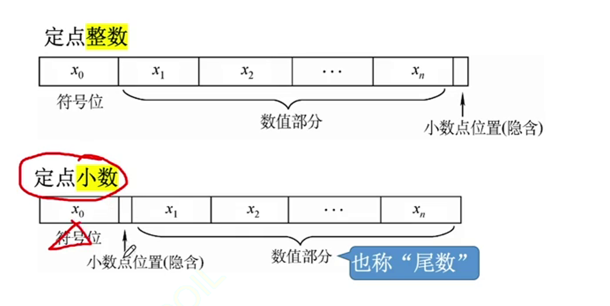

## 1. 进制计数制及其相互转换

罗马数字——基于加法思想的计数方法

阿拉伯数字——十进制

**位权**：数值上每一位代表的数值大小，即比如1000,100...等权重

**基数**：每个数码位所用到的不同符号的个数，r进制的基数为r

二进制：101.1$\to 1·2^2+0·2^1+1·2^0+1·2^{-1}$

:::tip 为什么计算机使用二进制？
1. 可使用两个稳定状态的物理器件表示
2. 0，1正好对应逻辑值假，真。方便实现逻辑运算
3. 可以很方便的使用逻辑门电路实现算术运算
:::

### 二进制与八进制

3位为1组，每组互相转换

### 二进制与十六进制

4位符号为一组，每组互相转换

二进制的表示方式：101010B

十六进制：1652H 0x1652

十进制：1652D

### 十进制→任意进制

分为整数部分和小数部分分别处理

对整数部位每次除以目标进制r，所得余数即为最低进制的数码位

例子：75 十进制→二进制

75/2=37.. 1

37/2=18.. 1

18/2=9 ..0

9/2=4 ..1

4/2=2 ..0

2/2=1 ..0

1/2=0 ..1

从下往上数即为结果：1001011

小数部分每次**乘以**目标进制r，所得结果的整数部分即为对应进制的数码位

例子：0.4
0.4*2=0.8 0

0.8*2=1.6 1

0.6*2=1.2 1

0.2*2=0.4 0

从上往下数即为结果，即0.0110

也可以用拼凑法(直接看对应的数值，抓阄)

整数一定可以转换为二进制，但是小数部分不一定可以

### 真值与机器数

真值：符合人类习惯的数字

机器数：数字实际存到机器里的形式

## 2. 定点数的表示

定点数：小数点的位置固定

浮点数：小数点的位置不固定，就是科学计数法

### 1.无符号数

整个机器字长的全部二进制位均为数值位，没有符号位，相当于数的绝对值

表示范围：8位二进制数：$2^8$种不同的状态，范围为$0\~2^8-1$

n位无符号数的表示范围为$0\~2^n-1$

通常只有无符号整数，没有无符号小数

### 2. 原码

用尾数表示真值的绝对值，符号位0/1表示正负

==若机器字长为n+1位，则位数占n位==

数值部分也可以叫尾数

**定点小数**：定点小数是纯小数，约定小数点位置在符号位之后

**定点整数**：定点整数是纯整数，约定小数点位置在有效数值最低位置后

小数点位置均为隐含

如果没有写明机器字长，则在写原码时可以忽略开头的0

记为$[X]_\text{原}=1,00110$

>逗号的作用是用来标记符号位

若机器字长n+1位，则原码整数的表示范围为：

$$-(2^n-1)\leq x\leq 2^n -1$$

原码表示定点小数范围：

$$-(1-2^{-n})\leq x\leq 1-2^{-n}$$

==真值0有+0和-0两种形式==

### 3. 反码

若符号位为0，则反码与原码相同

若符号位为1，则反码是原码的数值位全部取反

x=+19D 原码：0,0010011

反码：0,0010011

X=-19D 原码：1,0010011

反码：1,1101100

反码的表示范围和原码一致

:::warning
反码只是原码转变为补码的一个中间状态，没有什么用
:::

### 4. 补码

