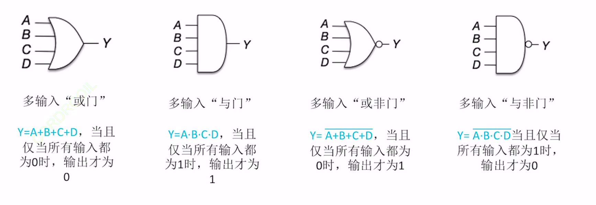
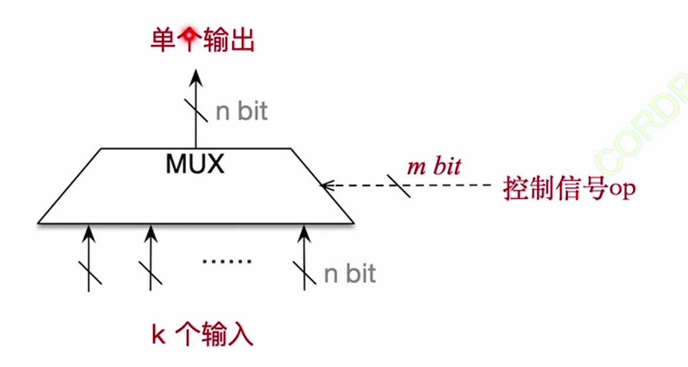
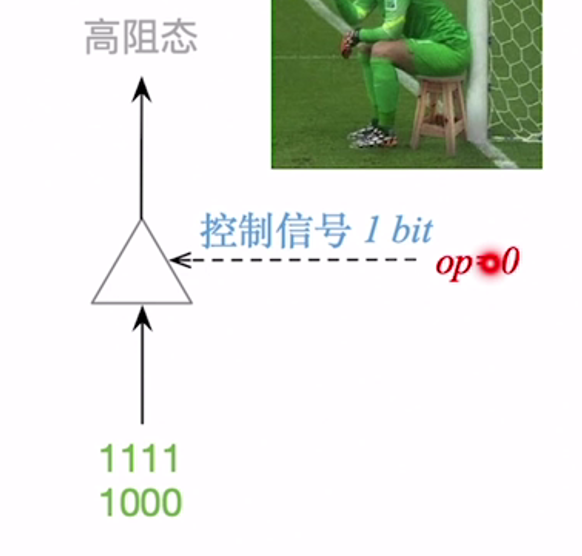
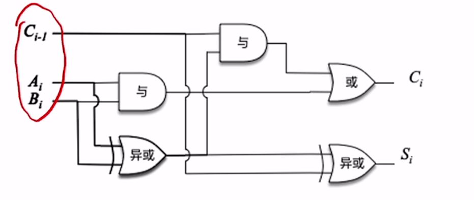
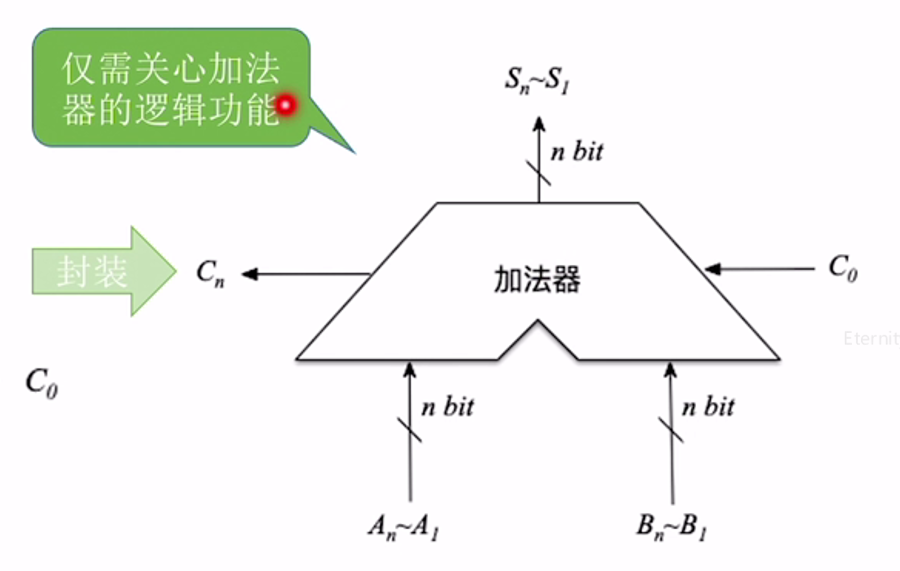
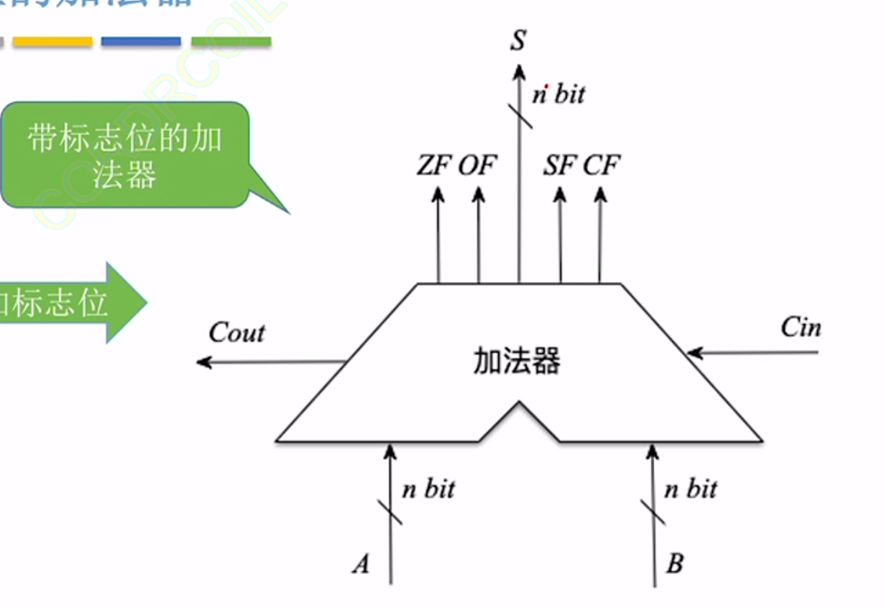
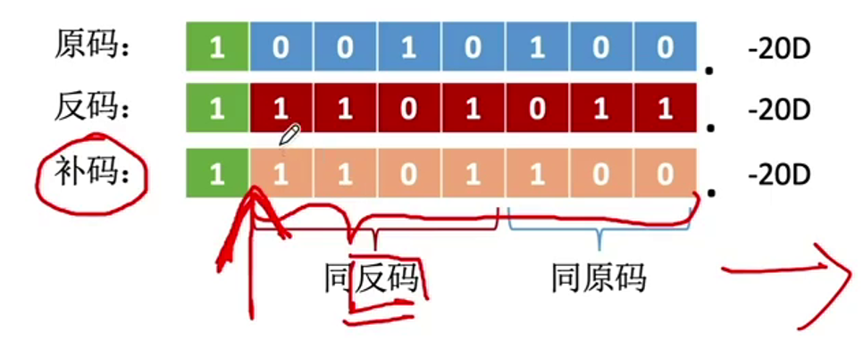
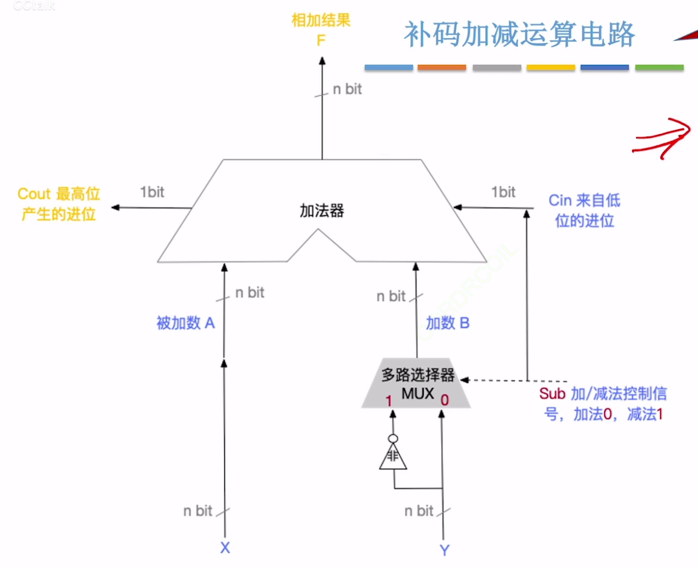

## 1. 基本运算部件

算术运算：对数字进行运算，如加减乘除、幂次方

逻辑运算：对逻辑值(真/假)进行运算，如：与、或、非、异或

无论是算术运算，还是逻辑运算，都要有输入、输出

### 1. 与运算

与 AND

表达式：$Y=A·B$，也可简写为$Y=AB$

| A | B | Y |
| - | - | - |
| 0 | 0 | 0 |
| 0 | 1 | 0 |
| 1 | 0 | 0 |
| 1 | 1 | 1 |

必须全为真，才是真

### 2.或运算

或 OR

表达式：$Y=A+B$

| A | B | Y |
| - | - | - |
| 0 | 0 | 0 |
| 0 | 1 | 1 |
| 1 | 0 | 1 |
| 1 | 1 | 1 |

只要有一个真，就全是真

### 3. 非运算

非 NOT

$Y=\bar{A}$

| A | Y |
| - | - |
| 0 | 1 |
| 1 | 0 |

### 4. 复合逻辑运算：与非

与非 NAND

Y=$\overline{A·B}$

| A | B | Y |
| - | - | - |
| 0 | 0 | 1 |
| 0 | 1 | 1 |
| 1 | 0 | 1 |
| 1 | 1 | 0 |

和**与门**的输出结果相反

### 5.符合逻辑运算：或非

或非 NOR

$Y=\overline{A+B}$

| A | B | Y |
| - | - | - |
| 0 | 0 | 1 |
| 0 | 1 | 0 |
| 1 | 0 | 0 |
| 1 | 1 | 0 |

和**或门**的输出结果相反

### 6.复合逻辑运算：异或

异或 XOR

$Y=A\bigoplus B(=\bar{A}B+A\bar{B})$

| A | B | Y |
| - | - | - |
| 0 | 0 | 0 |
| 0 | 1 | 1 |
| 1 | 0 | 1 |
| 1 | 1 | 0 |

只有当两个输出值不同时才输出1

### 7.复合逻辑运算：同或

同或 XNOR

$Y=A\bigodot B(=\overline{A\bigoplus B})$

| A | B | Y |
| - | - | - |
| 0 | 0 | 1 |
| 0 | 1 | 0 |
| 1 | 0 | 0 |
| 1 | 1 | 1 |

效果就是在异或门上接了个非门 

有些地方会翻译成异或非门

:::tip 异或的妙用
n个bit进行异或，若有奇数个1，则异或结果为1；若有偶数个1，则异或结果为0
:::

:::tip 封装思想
屏蔽电路部件的内部实现细节，仅对外暴露输入/输出引脚

使用者仅需关心该部件的功能即可
:::

### 8. 补充1 门电路的变形画法

### 9. 补充2 逻辑运算的优先级与常见公式

优先级：非>与>或

可以类比乘方、乘法、加法之间的关系

反演律：$\overline{A+B}=\bar{A}·\bar{B}$

$\overline{A·B}=\bar{A}+\bar{B}$

逻辑表达式是对电路的数学化描述

### 10. 多路选择器

作用：在多个输入数据中，只允许其中一个数据通过MUX

通常用梯形来表示，更长的一边是输入端，更短的一边是输出端

若有k个输入，则控制信号的位数是$,\geq \lceil\log_2k\rceil bit$

控制信号决定了第x位输入可以通过
 
有的多路选择器可能会预留一个控制信号(状态)，用于拦截所有输入

### 11. 三态门

根据控制信号决定是否让输入的数据通过，0为阻拦，1为通过
 
仅有一个输入端和一个输出端

有些时候可能会出现在三态门的一端加一个"小圆圈"，增加非运算的效果

非门没有控制信号的通过与否，只修改信号的是非

## 2. 加法器

n位整数可以被拆价为n个1位加法

分别为：

$A_i$：被加数的本位

$B_i$：加数的本位

$C_{i-1}$：来自低位的进位

$S_i$：本位和

输入：$A_i,B_i,C_{i-1}$

输出：$S_i=A_i\bigoplus B_i\bigoplus C_{i-1}$(输入中有奇数个1时输出1)

$C_i=A_i·B_i+(A_i\bigoplus B_i)C_{i-1}$(输入中至少有2个1时输入1) 

若把n个以为全加器串接起来，就可以进行两个n bit树的相加(即每个进位输入输出互相串联)

不足之处：进位信息是串行产生的，计算速度取决于进位产生和传递的速度

电信号达到稳态需要一定时间，进位产生速度会有延迟

串行进位又称为行波进位，每一级进位直接依赖于前一级的进位，即进位信号是逐级产生的

这种加法器输入**并行加法器**

从进位方式来看，又输入**串行进位加法器**

并行进位的并行加法器：所有进位信息都是同时发生的，几乎没有延迟。

特点：运算速度比串行进位的并行加法器更快

### 带标志位的加法器

有时候还需要关心加法器的运算结果是正是负

+ **OF(Overflow Flag)：溢出标志**，用于判断带符号数加减运算是否溢出

OF=1 溢出； OF=0 未溢出

$OF=C_n\bigoplus C_{n-1}$，最高位的进位异或次高位的进位，反映带符号数加减运算是否溢出

+ **SF(Sign Flag)：符号标志**，用于判断带符号数加减运算结果的正负性

SF=1 结果为负；SF=0 结果为正

$SF=S_n$，直接取运算结果的最高位(符号位)，反映带符号数加减运算的正负性

+ **ZF(Zero Flag)：零标志**，用于判断加减运算结果是否为0

ZF=1 结果为0； ZF=0 结果不为0

ZF=$\overline{S_n+\cdots+S_2+S_1}$，当且仅当运算结果所有比特位全0时，ZF才为1

+ **CF(Carry Flag)：进位/借位标志**，用于判断无符号数加减运算是否溢出
CF=1 溢出；CF=0 未溢出

$CF=C_{out}\bigoplus C_{in}=C_n\bigoplus C_0$，反映无符号数加减运算是否溢出

### 并行进位加法器

串行进位加法器的进位基于递归的思想

第i位向更高位的进位$C_i$可以根据被加数、加数的第1\~i位，再结合$C_0$即可决定

各级进位信号同时形成，又称为先行进位、同时进位

$$C_i=\sum_{i=1}^{n-1}(G_i·\prod_{j=i+1}^nP_j)+\prod_{j=1}^n·C_0$$

继续套娃会导致电路越来越复杂

一般最多支持4位+4位运算，即4位CLA加法器——由4个FA和一些新的线路、运算逻辑组成

### 算术逻辑单元——ALU

ALU被包含在运算器当中

ALU是一种组合逻辑电路，实现了加减乘除、与或非等功能，因此ALU是运算器的核心

由于加减乘除等运算都要基于加法来实现，因此加法器是ALU的核心

==重点==：如果ALU支持k种功能，则控制信号位数$m\geq\lceil\log_2k\rceil$

ALU的运算数、运算结果位数和计算机的机器字长相同

ALU同样可能存在标志位，标志信息通常会被送入PSW程序状态字寄存器

有的计算机系统会把PSW寄存器称为**标志寄存器FR(Flag Register)**

## 3. 移位运算

### 1. 算术移位

就相当于移动小数点，后移一位相当于乘10，后移两位相当于乘100，前移以此类推

移动了小数点相当于移动了位权

原码的算术移位：符号位保持不变，仅对数值位进行移位

原码算术移位的规则：左移时，高位移出，低位补0；右移时，低位移出，高位补0。

左右移相当于乘2和除以2

如果低位的1被移出，则会影响精度

如果高位的1被移出，则会出现严重误差

正数反码和原码相同，负数反码和原码相反

==补码==的算术移位：

正数：右移：高位补0，低位舍弃

左移：低位补0，高位舍弃

负数：

负数补码中，最后的1及右侧同原码，左侧同反码

==这个规律也可以用来快速识别负数补码转原码==

==负数补码==的算术移位规则：

右移(同反码)：高位补1，低位舍弃

左移(同原码)：低位补0，高位舍弃 

==符号位同样需要参与左移==

算术移位的应用举例：计算机的乘法实际上使用算术移位进行的

例如20×7，就是$20·(2^0+2^1+2^2)$，分解为多个移位和加法

### 2. 逻辑移位

逻辑右移：高位补0，低位舍弃

逻辑左移：低位补0，高位舍弃

逻辑移位就相当于无符号数的移位

应用举例：RGB值的存储，将三个值按左中右依次存储至同一个数据中

### 3. 循环移位

就是循环嘛

循环左移：将高位填补到低位中

逻辑右移：将低位填补到高位中

带进位位的移位：用于记录是否存在溢出的符号位，原本的舍弃位填补至进位位中，进位位的数据填补到低位中

由于原码、反码、补码位数有限，因此有时候算术移位不能精确等效乘法、除法

## 4. 定点数的加减运算

### 原码的加减法运算(仅做了解)

加法器若直接怼原码进行加法运算，可能出错(无法正确处理带符号数)

原码的加法运算：

正+正——绝对值做加法，结果为正

负+负——绝对值做解法，结果为负

正+负——绝对值大的减绝对值小的，符号同绝对值大的数

减法运算：减数符号取反，转变为加法

### 补码的加减法运算

补码的加减法不需要考虑符号位

直接丢给加法器就好了！

A=15，B=-24

$[A+B]_{\text{补}}=[A]_{\text{补}}+[B]_{\text{补}}=0,0001111+1,1101000=1,1110111$

$[A-B]_{\text{补}}=[A]_{\text{补}}+[-B]_{\text{补}}=0,0001111+0,0011000=0,0100111$

对于补码来说，无论加法还是减法，最后都会转变成加法，由加法器实现运算，符号位也参与运算

如果计算结果超出了范围，则称发生了**溢出**

上溢：正数+正数=负数

下溢：负数+负数=正数

### 溢出判断

1. 采用一位符号位

设A的符号位为$A_S$，B的符号位为$B_S$，运算结果的符号位为$S_S$，则溢出判断表达式为

$V=A_SB_S\overline{S_S}+\overline{A_S}\overline{B_S}S_S$

若V=0，表示无溢出

若V=1，表示有溢出

2. 采用一位符号位，根据数据位进位情况判断溢出

即：若最高位和符号位的进位情况不同，则发生溢出

$V=C_S\bigoplus C_1$

若V=0，表示无溢出

若V=1，表示有溢出

:::tip
如果是全1，则说明符号位被爆了一次，但还是负数
:::

3. 采用双符号位

正数符号为00，负数符号为11

上溢：01

下溢：10

记两个符号位为$S_{S1},S_{S2}$

则$V=S_{S1}\bigoplus S_{S2}$

若V=0，表示无溢出

若V=1，表示有溢出

双符号位补码又称模4补码

单符号位补码又称模2补码

:::tip
模X补码的含义是，将符号位看作整数部分， 由于只保留x位，相当于对原整数进行模x计算，因此叫做模x补码
:::

:::tip
双符号位实际存储时只存储一个符号位，只是在运算时会复制一个符号位，相当于双符号位是一种逻辑结构，而不是物理结构
:::

### 无符号数的加减运算

带符号数的加法实际是补码的运算

无符号整数的加法：从最低位开始，按位相加，依次进位

实际上，处理减法，也是将减数按位取反末尾+1，减法变加法

手算判断溢出：n bit无符号整数的表示范围为$0 \sim 2^n-1$，超出该范围则溢出

计算机判断溢出的方法：

无符号数加法的溢出判断：最高位产生的进位=1时，发生溢出，否则未溢出

无符号数减法的溢出判断：减法变加法，最高位产生的进位=0时，发生溢出，否则未溢出

### 加减运算的电路实现

通过多路选择器来决定是加法还是减法

如果是加法，则直接正常加即可

如果是减法，则加一个非门，将减数全部取反，然后通过进位器输入+1来实现补码的效果

## 5. 定点数的乘除运算

### 1. 定点数乘法运算

相当于十进制的竖式运算

计算机可以用用移位来实现不同位权的相乘相加

红色的位权最低位就是两边位权最低位的相乘

==计算机处理原码一位乘法==

符号单独处理：符号位=$X_S\bigoplus Y_S$

数值位取绝对值进行处理

如果是数值位有n位：

==实现方法：先加法再右移，重复n次==

加法是高位直接加上被乘数

逻辑右移，高位补零

若当前处理位是1，那就高位加上北乘数

如果当前处理位是0，那不加，直接移

为什么要右移？因为乘数的低位在处理完先前的步骤后已经用不上了，可以丢弃或者输出了

一位乘法：每次只有一位参与运算

### 2. 补码的乘法方法(好像不考太深奥的)

补码一位加法需要比原码一位乘法最后多来一次加法

补码每次加法有可能加0，加x的补码，-x的补码，需要根据MQ的最低位、辅助位来确定加什么

每次移位是算数右移，补符号位

符号位参与运算

所有寄存器都统一用n+2位，因此采用双符号位补码运算

### 3. 原码的除法

x/y=a(余数b)→x=ay+b

0.211=0.985*0.214+0.000210

二进制除法参照如下流程：

规律：忽略小数点，每确定一位商，进行一次减法，得到4位余数，在余数末尾补0，再确定下一位商，确定5位商即可停止(假设机器字长为5位)

>byd好像说这块不咋考，先不看了，浪费时间

## 总结

### 1. ALU的标志位

| 简写 | 名称 | 逻辑表达式 | 功能 |
| --- | ---- | --------- | --- |
| OF(Overflow Flag) | 溢出标志 | $OF=C_n\bigoplus C_{n-1}$ | 手算时直接把两个加数==看成==有符号数相加看结果是否溢出即可 |
| SF(Sign Flag) | 符号标志 | $SF=S_n$ | 直接把数字看成有符号数看是正是负即可 |
| ZF(Zero Flag) | 零标志 | $\overline{S_n+\cdots+S_2+S_1}$ | 直接看结果是不是零即可 |
| CF(Carry Flag) | 进位/借位标志 | $C_{out}\bigoplus C_{in}$ | 直接把两个加数==看成无符号数==看相加结果是否溢出即可 |

### 2. 补码的移位运算的区别

| 方向 | 算术移位 | 逻辑移位 |
| --- | ------- | -------- |
| 左移 | 高位移出，低位补0 | 高位移出，低位补0 |
| 右移 | 低位移出，高位补1 | 低位移出，高位补0 | 

