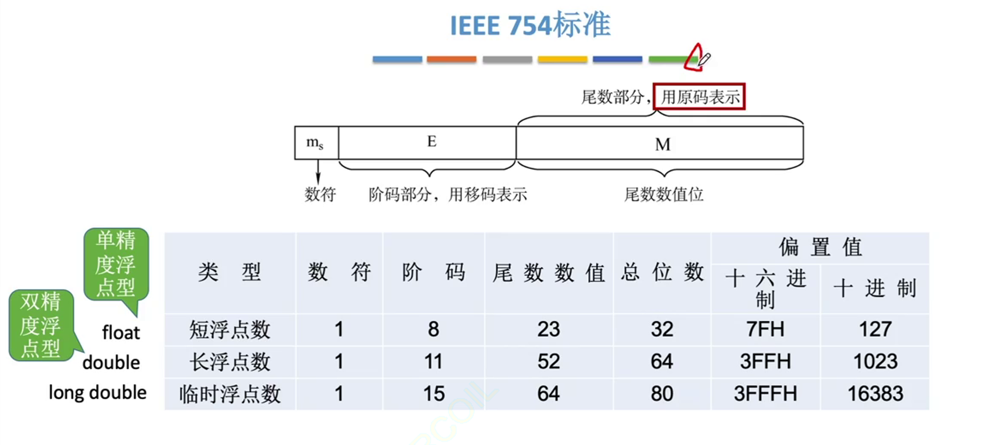
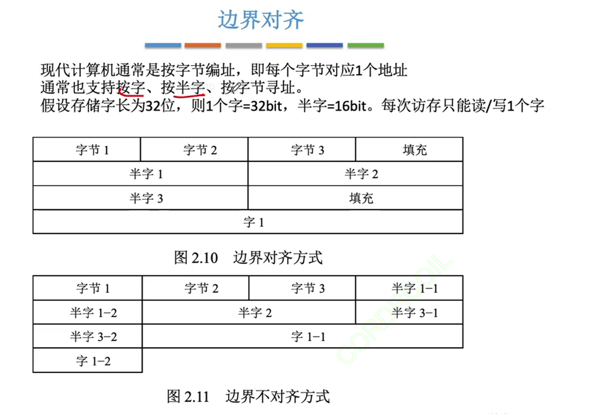

## 1. 浮点数的表示

### 1. 浮点数的表示格式
定点数有时候无法表示极大数，其可表示的数字范围有限，又不能无限制地增加数据的长度

浮点数的思想和科学计数法差不多！

阶码：常用补码或移码表示的顶点整数

尾数：常用原码或补码表示的定点小数

通常，浮点数的真值表示为

$$N=r^E×M$$

r: 阶码的底，通常为2

E：阶码，反映了浮点数的表示范围及小数点的实际位置

M：尾数，其位数反映了浮点数的精度

尾数给出一个小数，阶码指明了小数点要往前/往后移动几位

### 2. 浮点数的规格化

尾数的数值部分最高位一定要是有效值，==即最高位一定是1==

通过算术左移将浮点数进行规格化，称为**左规**，阶码-1

同样的，当浮点数运算的结果尾数出现溢出(双符号位为01或10)时，算数右移称为**右规**，阶码+1

:::tip
采用双符号位，当发生溢出时，可以挽救。更高的符号位才是正确的符号位

对负数补码进行规格化的步骤就是算术左移右移！回顾上一节！
:::

==规格化浮点数的特点==

1. 以原码表示的尾数进行规格化：

正数表示范围为$1/2\leq M\leq(1-2^{-n})$

负数表示范围为$-(1-2^{-n})\leq M\leq -1/2$

2. 以补码表示的位数进行规格化

正数表示范围为$1/2\leq M\leq(1-2^{-n})$

负数的位数首位必须是0，即==尾数符号位和尾数最高数值位必须不同==

负数表示范围为$-1\leq M\leq -(1/2+2^{-n})$

<s>遇到正下溢或负上溢的情况，通常视作0</s>

范围已经被大纲删除了，不用看！！！

### 3. 浮点数标准 IEEE 754

IEEE标准中，指数(阶码)部分是以移码表示的

隐藏表示最高位1：省去每次都要规格化的问题

偏置值：$2^{n-1}-1$

IEEE标准中，阶码全1和全0用作特殊用途

所以8位阶码的真值的正常范围为-126\~127

==阶码真值=移码-偏移量==

可以先把移码看成十进制，然后再减去偏移量，比较快出结果而且不容易出错

例子：将$-0.75_{10}$转换为IEEE 754的单精度浮点数格式表示

$$(-0.75)_{10}=(-0.11)_2=(-1.1)_2×2^{-1}$$

数符=$\color{red}{1}$(负数)

尾数部分：$\color{green}{10000...}$(隐含最高位1)

阶码真值：-1

单精度浮点型偏移量：127D

移码=阶码真值+偏移量=-1+111 1111=$\color{blue}{0111 1110}$(凑足8位)

所以阶码就是：

$$\color{red}{1}\space\color{blue}{011 1111 0}\color{green}{10000000....}$$

单精度浮点型能表示的范围：

最小绝对值：尾数全为0，阶码真值最小-126，对应移码机器数0000 0001

此时整体真值为$(1.0)_2×2^{-126}$

最大绝对值：尾数全为1，阶码真值最大127，对应移码机器数1111 1110

此时整体的真值为$(1.111...11)_2×2^{127}$

:::tip
+ 若阶码全为0，且尾数M不全为0，则称为<u>非规格化小数</u>：$\pm(0.\text{xx...x})_2×2^{-126}$

此时隐含最高位变为0，阶码真值固定为-126

+ 若阶码全为0，尾数M全为0，则表示<u>真值</u>：$\pm 0$

+ 若阶码全为1，尾数M全为0，则表示<u>无穷大</u>：$\pm\infty$

+ 若阶码全为1，尾数M不全为0，则表示<u>非数值</u>："NaN"(非法运算)
:::

## 2. 浮点数的加减运算

步骤：
0. 真值转换到机器数

1. 对阶：小阶向大阶靠齐

对阶可能导致丢失末位精度

==注意：只有尾数右移的对阶==

2. 尾数加减

通常使用双符号位来表示尾数，来减轻尾数溢出的影响

3. 规格化

尾数最高数值位为无效位时，尾数左移，阶码减1

尾数双符号位不同时，尾数右移，阶码加1

4. 舍入 如果规定只能保留x位有效尾数，则多余部分直接砍掉

或者，如果砍掉的部分最高位非0，则往前入1

或者，不管丢掉的最高数值位是多少，右移后的位数末位恒置1

5. 判溢出 若规定阶码不能超过x位，则运算后若阶码超出范围，则溢出

:::tip
当真值小于最小绝对值时，称为正下溢或负下溢，此时视作机器数0

当真值大于最大绝对值时，称为正上溢或负上溢，此时抛出异常
:::

注：尾数溢出未必导致整体溢出，也许可以通过3、4步来拯救

## 3. 浮点数的强制类型转换

在32位机器下，以char→int→long→double和float→double→的类型转换的范围和精度从小到大，没有损失

int→float：可能损失精度

float→int：可能溢出及损失精度

int：表示整数，范围$-2^{31}\sim 2^{31}-1$，有效数字32位

float：表示整数及小数，范围$\pm[2^{-126}\sim2^{127}×(2-2^{-23})]$，有效数字23+1=24位

## 4. 数据的存储和排列

### 1. 大小端
多字节数据在内存里一定是占连续的几个字节

大端存储方式：高位有效字节存储在低位地址中，字中的字节顺序与原序列相同

小端存储方式：高位有效字节存储在高位地址中，字中的字节顺序与原序列相反

### 2. 边界对齐

边界对齐是一种空间换时间的方式，如果一个字/半字存储在了不同的地址，则需要访问多个地址

