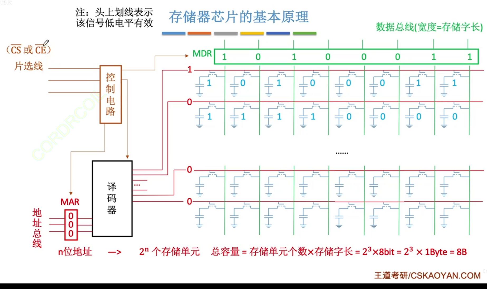

## 0. 主存储器的基本组成

### 1. 基本的半导体元件及原理
存储体由多个存储单元构成

每个存储单元由多个存储元组成

MOS管：电控开关，输入电压达到阈值时，MOS管就可以接通

高电平下，电容开始充电；低电平下，电容不会充电

电容可以保存电荷(信息)，并在MOS管接通时进行读出/读入

红线接通高电平时，可以接通该行所有的MOS管

一行存储元称为存储单元

多个存储单元称为存储体

一个存储单元能读出来的数据称为存储字

**总容量=存储单元个数×存储字长**

MAR的作用是选择接通对应的**字选线**(就是控制MOS管的红线)

控制电路的作用是防止MAR数据稳定前将数据发送至译码器，同时也防止输出信号在稳定前被MDR传输出去

片选线：发出芯片选择信号(CS)，该信号低电平时，控制电路的开关接通

读/写控制线：低电平时，允许读/写

当只采用一根读写线时，低电平允许写，高电平允许读

为了保证译码器的稳定可靠，还需要再译码器后增加一个驱动器，用于放大译码器

8×8的存储芯片

第一个数字表示的是有几个存储单元

第二个数字表示的是字长

常见的描述：

8K×8位，即$2^{13}×8bit$

8K×1位，即$2^{13}×1bit$

64K×16位，即$2^{16}×16bit$

### 2.寻址

字长为4B

总容量为1KB

按字节寻址：1K个单元，每个单元1B，总地址线10根($1024=2^{10}$)

按字寻址：256个单元，每个单元4B(字长为4B)，直接将地址算术右移2为就是字的地址了

n位地址→$2^n$个存储单元

## 1. SRAM和DRAM芯片

### 1.介绍
DRAM，动态RAM，用于主存

SRAM，静态RAM，用于Cache

**DRAM的存储元**

栅极电容：1表示电容内存储了电荷，0表示没有存储电荷

读出1：MOS管接通，电容放电，数据线上产生电流

读出0：MOS管接通后，数据线上无电流

由于电容的电荷会慢慢消失，因此有可能会造成误差。电容内的电荷只能维持2ms，即便不断电，2ms后信息也不会消失。因此，2ms之内必须给电容充电，称为==刷新==

电容放电后，信息被破坏，是==破坏性读出==

读出后应有==重写==操作，也称为“再生”，读取速度更慢

每个存储元的制造成本更低，集成度高，功耗低

**SRAM的存储元**

双稳态触发器

数据线有两根

读出0时，BL输出低电平信号

读出1时，BLX输出低电平信号

1：A高B低

0：A低B高

读出数据，触发器状态保持稳定，是==非破坏性读出==，无需重写，读取速度更快

每个存储元的制造成本更高，集成度低，功耗大

只要不断电，触发器的状态就不会改变

| 类型特点 | SRAM | DRAM |
| :-----: | :---: | :---: |
| 存储信息 | 触发器 | 电容 |
| 破坏性读出 | 否 | 是 |
| 读出后是否需要重写 | 否 | 是 |
| 运行速度 | 快 | 慢 |
| 集成度 | 低 | 高 |
| 发热量 | 大 | 小 |
| 存储成本 | 高 | 低 |
| 存储器类型 | 易失性存储器 | 易失性存储器 |
| 是否需要"刷新" | 否 | 是 |
| 送行列地址的方式 | 同时送 | 分两次送 |
| 用途 | 常用于Cache | 常用于主存 |
### 2. DRAM的刷新

刷新周期：一般为2ms

每次刷新存储单元的个数应该是以行为单位，每次刷新一行存储单元

存储单元排列成一个正方形矩阵，拆分为行列地址(DRAM行列地址等长)

**采用行列地址的策略，可以让选通线的数量大幅减少**

刷新方式：有硬件支持，读出一行的信息后重新写入，占一个读写周期

刷新时刻：

+ 每次读写完都刷新一行

系统的存取周期变为两倍

+ 2ms内集中安排时间全部刷新

系统的存取周期不变，但有一段时间专门用于刷新，无法访问存储器，称为访存“死区”

+ 2ms内每行刷新一次即可

即，把每行的刷新时间分散开，称为异步刷新

:::tip
刷新操作由存储器单独完成，不需要CPU控制
:::

### 3. 地址线复用技术

DRAM的空间较大，将地址折半传输，分别传输给行地址缓冲器和列地址缓冲器，可以减少引脚的数量和地址线的数量

:::tip
现在的主存通常采用SDRAM芯片
:::

## 2. 只读存储器ROM

ROM芯片均为非易失性存储器

+ MROM(Mask Read-Only Memory)
  
掩模式只读存储器

在芯片生产过程中直接写入信息，之后任何人==不可重写，只可读出==

可靠性高、灵活性差、生产周期长、只适合批量定制

+ PROM(Programmable Read-Only Memory)
  
可编程只读存储器

用户可用专门的PROM写入器写入信息，但写入一次后就不可再更改

+ EPROM(Erasable Programmable Read-Only Memory)
  
可擦出可编程只读存储器

+ UVEPROM
  
用紫外线照射一段时间，可擦除所有信息

+ EEPROM

可用电擦除的方式，擦除特定的字

+ Flash Memory
  
闪速存储器(闪存)，在EEPROM基础上发展而来，断电后也能保存信息，且可进行多次快速擦除重写

注：由于闪存需要先擦除再写入，因此闪存的写速度要比读速度更慢

每个存储元只需单个MOS管，位密度比RAM高

+ SSD(Solid State Drives)

固态硬盘，由控制单元+存储单元(Flash芯片)构成，与闪存的核心区别在于控制单元不一样

+ BIOS芯片

主板上的BIOS芯片(ROM)，存储了自举装入程序，负责引导装入操作系统

## 3. 多模块存储器

### 0. 存取周期概念回顾

存取周期：可以连续读写的最短时间间隔

由于DRAM是破坏性读出，读出后应有重写操作，所以读写速度更慢，也就是说恢复时间更慢。

意思是，整个存取周期有可能是存取时间的好几倍(因为大部分时间都在恢复)

### 1. 多体并行存储器

每个模块都有相同的容量和存取速度

各模块都有独立的读写控制电路、地址寄存器、数据寄存器。

它们既能并行工作，又能交叉工作

可以理解为多根内存条

体号决定了要访问第几个存储器，体内地址决定了要访问存储器中的哪个位置

两种编址方案：

1. 高位交叉编址

用内存地址最高的两个比特位来区分需要访问哪根“内存条”

2. 低位交叉编址

就是用内存地址的最低位

存取周期为T，存取时间/总线传输周期为r，为了使流水线不间断，应该保证模块数$m\geq T/r$

设每个存储体的存取周期为T，存取时间为r，假设T=4r

高位：nT

低位：T+(n-1)r

### 2. 单体多字存储器

每个存储单元存储m个子，总线宽度m个字

一次并行读出m个字

### 3. 额外内容

单纯的扩容：插入内存条，实现高位交叉

双通道：低位交叉

