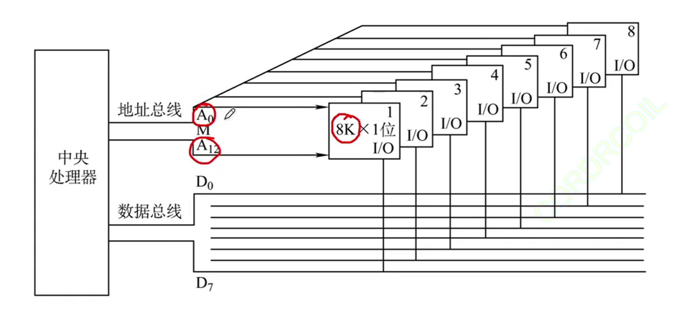
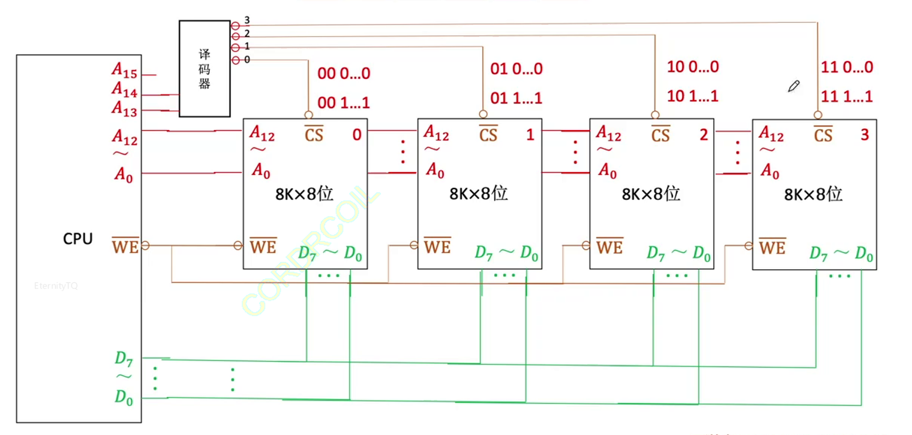
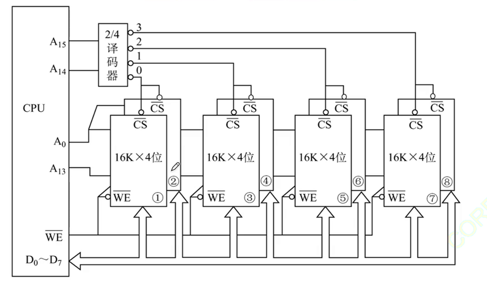

字扩展：扩展主存字数

位扩展：扩展存储芯片字长

## 1. 位扩展

位扩展是指对字长进行扩展

即，数据总线的能力没有被充分发挥

CPU发出的地址信息$(A_0\sim A_{12})$会分别送到不同的存储芯片上

而从存储芯片上读出的信息可以被数据总线同时读入CPU

## 2. 字扩展

CPU的寻址能力没有被充分发挥

线选法：使用一条专门的线来选择指定的存储芯片，效率低下

移码片选法：n条线→$2^n$个片选信号

将CPU上多余的n条地址线接入译码器

注意每块地址的取值范围

:::tip
使用字扩展后，可以保证主存合法的地址范围从00...00到11...11
:::

| 线选法 | ==译码片选法== |
| --- | --- |
| n条线→n个选片信号 | n条线→$2^n$个选片信号 |
| 电路简单 | 电路复杂 |
| 地址空间不连续 | 地址空间可连续 |

## 3. 字位同时扩展

位扩展：两块芯片为一组，奇数号芯片读出$D_0\sim D_3$，偶数号芯片读出$D_4\sim D_7$

将$A_0\sim A_{13}$作为片内地址

将$A_{14}\sim A_{15}$作为高位译码地址

