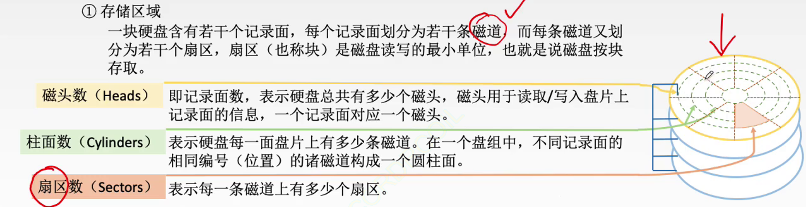
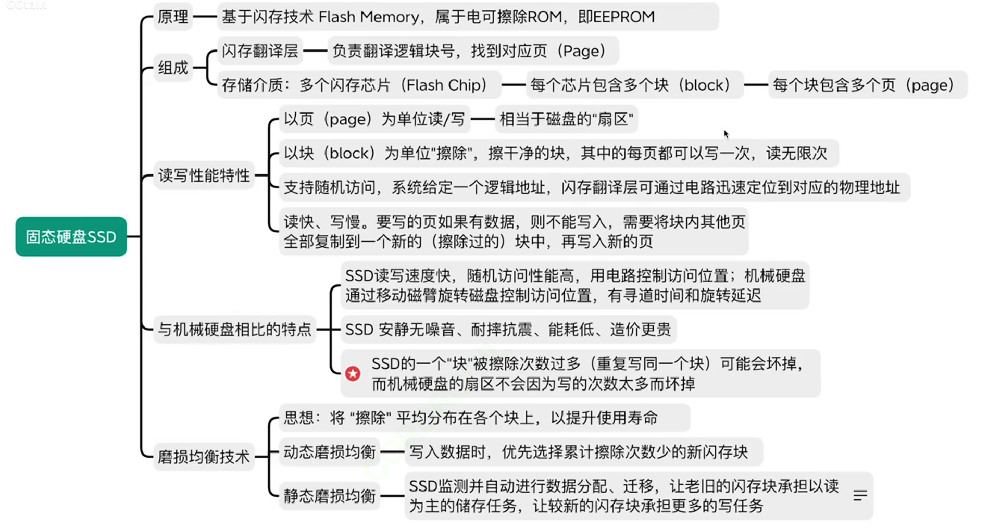

## 1. 磁盘存储器

磁盘的外存储器，又称辅助存储器

磁表面存储：一次只能读入1bit

磁表面存储器的优点：
1. 存储容量大、位价格低
2. 记录介质可以重复使用
3. 记录信息可以长期保存不丢失，甚至可以脱机存档
4. 非破坏性读出，无需再生

缺点：
1. 存取速度慢
2. 机械结构复杂
3. 对工作环境要求高

### 1. 磁盘设备的组成

#### 1. 存储区域：

一块磁盘含有若干个记录面，每个记录面划分为若干条磁道，而每条磁道又划分为若干个扇区，扇区(也称块)是磁盘读写的最小单位，也就是说磁盘按块存取

磁头：记录面数，表示共有几个磁头

每一圈磁性材料：磁道

柱面数：表示硬盘每一面盘片上有多少条磁道。

在一个盘组中，不同记录面的相同编号(位置)的诸磁道构成一个圆柱面

扇区数：表示每一条磁道上有多少个扇区

:::tip
一个磁盘包含多个面(就是几个碟子)

一个面包含多个磁道(就是几个圈)

一个磁道上有多个扇区(就是这个圈被划成了几份)
:::

#### 2. 磁盘存储器

磁盘存储器由磁盘驱动器、磁盘控制器和盘片构成

磁盘驱动器：驱动磁盘转动并在盘面上通过磁头进行读写操作的装置

磁盘控制器：磁盘驱动器与主机的接口

### 2. 磁盘的性能指标

1. 磁盘的容量：一个磁盘所能存储的字节总数

非格式化容量：物理角度上能存储的磁化单元总数

格式化容量：按照某种特定的记录格式所能存储信息的总量，比如预留某些备份扇区，即实际使用的总量

2. 记录密度：盘片单位面积上记录的二进制的信息量

道密度：沿磁盘半径方向上的磁道数

位密度：磁道单位长度上能记录的二进制代码位数

面密度：位密度和道密度的乘积

:::tip
磁盘每个磁道记录的信息量都是相同的

并不是圆越大，信息越多

所以每个磁道的位密度都不同

也就是说，越内侧的磁道位密度越大
:::

3. 平均存取时间：

寻道时间+旋转延迟时间+传输时间

寻道时间：磁头移动到目的磁道

旋转延迟时间：磁头定位到所在扇区的时间，数学期望转半圈

传输时间：传输数据所花费的时间

4. 数据传输率：磁盘存储器在单位时间内向主机传送数据的字节数

假设磁盘转数为r(转/秒)，每条磁道容量为N个字节，则数据传输率为$D_r=rN$

### 3. 磁盘地址

磁盘地址一般有：

驱动器号 柱面号 盘面号 扇区号

举例：若系统中有4个驱动器，每个驱动器带一个磁盘，每个磁盘256个磁道，16个盘面，每个盘面划分为16个扇区，则每个扇区地址要18个二进制代码

### 4. 磁盘的工作过程

主要操作：寻址、读盘、写盘。每个操作都对应一个控制字

硬盘工作时，第一步是取控制字，第二步是执行控制字

硬盘属于机械式部件，其读写操作是串行的，不可能在同一时刻既读又写，也不可能在同一时刻读两组数据或写两组数据

### 5. 磁盘阵列

RAID是将多个独立的物理磁盘组成一个独立的逻辑盘，数据在多个物理盘上分割交叉存储、并行访问

类比第三章低位交叉编址的多体存储器

+ RAIDO：无冗余、无校验，把连续多个数据块交替地存在不同物理磁盘的扇区中，几个磁盘交叉并行读写
+ RAID1：镜像磁盘阵列。很粗暴，存两份数据
+ RAID2：采用纠错的海明码的磁盘阵列：逻辑上连续的几个bit，物理上会分散存储在各个盘中
+ RAID3：位交叉奇偶校验的磁盘阵列
+ RAID4：块交叉奇偶校验的磁盘阵列
+ RAID5：无独立校验的奇偶校验磁盘阵列

考试常考察：

==RAID0没有容错能力==

==RAID1容量减少一半==

RAID2~5：通过数据校验提高容错能力

## 2. 固态硬盘

