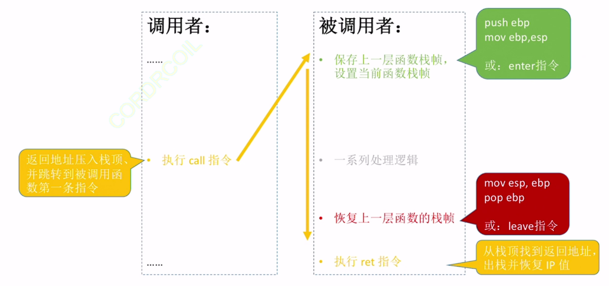

## 1. 地址码的作用

指令由操作码和地址码组成(回顾)

地址码指明数据——寄存器、主存、直接给出

根据数据的不同存放位置，地址码有不同的形式

### 1.1 存放在寄存器中

寄存器只要是以E开头，就是32bit

EAX EBX ECX EDX：==通用寄存器==(X=未知)，什么数据都能存

E=Extended

AX BX CX DX：==通用寄存器==，但只使用低16bit

AH BH CH DH：只使用AX BX CX DX的高8bit

AL BL CL DL：只使用低8bit

ESI EDI： ==变址寄存器==(I=Index,S=Source, D=Destination)

只能固定使用32bit

>变址寄存器可用于线性表和字符串的处理

EBP：==堆栈基指针==(Base Pointer)

ESP：==堆栈定指针==(Stack Pointer)

堆栈寄存器可用于函数调用(后续展开)

只能固定使用32bit

### 1.2 存放在主存中

在汇编指令中，给出读写长度、主存地址

读写长度：

dword ptr——双字，32bit

word ptr——单字，16bit

byte ptr——字节，8bit

若未指明内存读写长度，默认32bit

中括号[]指明一个地址，如word ptr[114514]

如[ebx]这样的形式是寄存器间接寻址

mov eax dword ptr [ebx]：将ebx所指的主存地址的32bit复制到eax寄存器中

mov eax, dword ptr [ebx+8] 将ebx+8所指主存地址的32bit复制到eax寄存器中

:::danger
mov指令两个操作数均不能来自于主存
:::

### 1.3 指令直接给出

直接在地址码中给出常量，即"立即寻址"

可用十进制表示，也可用十六进制(常以h结尾)

## 2. 常用汇编语言指令格式

### 2.1 算术运算

==d==estination 目的地 (d 目的操作数)

==s==ource 来源地 (s 源操作数)

目的操作数 d 不可以是常量，只能是主存或寄存器

| 功能 | 汇编指令 | 注释 |
| --- | ------- | --- |
| 加法 | add d, s | 计算d+s，结果存入d |
| 减法 | sub d, s | 计算d-s，结果存入d |
| 乘法 | mul d,s   imul d, s | 无符号数d\*s，乘积存入d 有符号数d\*s，乘积存入d |
| 除法 | div s   idiv s . | 无符号数除法 edx:eax/s，商存入eax，余数存入edx 有符号数除法edx:eax/s，商存入eax，余数存入edx  此处edx:eax是位扩展的意思，被除数提前放在寄存器中 |
| 取负数 | neg d | 将d取负数，结果存入d |
| 自增++ | inc d | d++，结果存入d|
| 自减-- | dec d | d--，结果存入d |

\<reg\> 操作数来源于任意寄存器

<mem\> 操作数来源于任意主存地址

<con\> 常数

==x86中不允许两个操作数均来自于主存==

### 2.2 逻辑运算

| 功能 | 汇编指令 |
| --- | ---- |
| 与 | and d, s |
| 或 | or d,s |
| 非 | not d |
| 异或 | xor d, s |
| 左移 | shl d, s (shift left)|
| 右移 | shr d, s (shift right)|

### 2.3 其他指令

用于实现分支、循环结构：cmp、test、jmp、jxxx

用于实现函数调用：push、pop、call、ret

用于实现数据转移：mov

## 3. AT&T格式与Intel格式的区别

在AT&T格式，未标明长度也默认32bit

| | AT&T格式 | Intel格式 |
| --- | --- | --- |
| 目的操作数d与原操作数s | op s,d， 左进右 | op d,s ，右进左 |
| 寄存器表示 | mov %eax, %ebx  寄存器前必须要加% | mov ebx , eax   直接给寄存器名即可 |
| 立即数表示 | mov $985, %eax 立即数前必须要加'$' | mov eax,985 直接写数字即可|
| 主存地址的表示 | mov %eax, (af996h)  用小括号表示 | mov [af996h] ,eax 用中括号表示 |
| 读写长度的表示 | movb $5 (af996h)  movw $5 (af996h) movl $5 (af996h) addb $4 (af996h) 指令后加b、w、l分别表示 byte、word、dword | mov byte ptr [af996h], 5 mov word ptr [af996h], 5 mov dword ptr [af996h], 5 add byte ptr [af996h], 4 在主存地址前说明读写长度 . |
| 偏移量表示 | movl -8(%ebx), %eax  偏移量(基址)  movl 4(%ebx, %ecx, 32), %eax 偏移量(基址,变址,比例因子) | mov eax, [ebx-8] [基址+偏移量]   mov eax, [ebx + ecx\*32+4] [基址+变址\*比例因子+偏移量]|

## 4. 选择语句的机器级表示

> Intel x86中，PC通常被称为IP(Instruction Pointer)

无条件转移指令：

jmp \<地址> #PC无条件转移至\<地址>

jmp 128 #\<地址>可以用常数给出

jmp eax #\<地址>可以来自于寄存器

jmp [999] #\<地址>可以来自于主存

jmp NEXT #\<地址>可以用"标号"锚定

汇编语言中，可以用"标号"锚定位置

特征：有冒号，名字可以自己取

例如：jmp NEXT

NEXT:

### 4.2 条件转移指令

| 指令 | 功能 |
| --- | ---- |
| je \<地址> | 若a==b则跳转 |
| jne \<地址> | 若a!=b则跳转 |
| jg \<地址> | 若a>b则跳转 |
| jge \<地址> | 若a>=b则跳转 |
| jl \<地址> | 若a<b则跳转 |
| jle \<地址> | 若a<=b则跳转 |

:::tip
条件转移指令一般要和cmp指令一起使用，如

cmp eax, ebx

jg NEXT;

cmp的数可能来自寄存器/主存/常量
:::

:::tip cmp的底层原理
本质是进行减法运算，并生成标志位OF,ZF,CF,SF
:::

## 5. 循环语句的机器级表示

用条件转移指令实现循环，需要4个部分构成：

1. 循环前的初始化
2. 是否直接跳过循环(已不满足循环条件)
3. 循环主体
4. 是否继续循环

### 5.1 用loop指令实现循环

mov ecx , 500 #loop指令默认使用ecx作为循环计数器

Looptop: #循环的开始

...

某些处理

...

loop Looptop #ecx--，若ecx!=0，跳转到Looptop

:::tip
考试时只需要结合C语言代码逆推判断汇编语言指令功能即可
:::

## 6. 函数调用的机器级表示

### 6.1 函数的调用

call \<函数名> 函数调用指令

ret 函数返回指令

通常用函数名作为函数起始地址的\<标号>

:::tip call指令的作用
1.将IP旧值压栈保存(保存在函数的栈帧顶部)

2.设置IP新值，无条件转移至被调用函数的第一条指令
:::

:::tip ret指令的作用
从函数的栈帧顶部找到IP旧值，将其出栈并恢复IP寄存器
:::

### 6.2 函数调用栈与栈帧

函数的栈帧：保存函数大括号内定义的局部变量、保存函数调用的相关信息

==函数调用栈通常栈顶在低地址，栈底在高地址==

标记栈帧范围：EBP/ESP寄存器

ebp：指向当前栈帧的底部

esp: 指向当前栈帧的顶部

x86系统中，默认以4字节为栈的操作单位

访问栈帧数据：push、pop

默认均以4字节为单位

push \<操作数>先让esp-4，在将数据压入

操作数可以是立即数、寄存器、主存地址

pop \<操作数> 先将栈顶元素写入指定元素，再让esp+4

操作数可以是寄存器、主存地址

访问栈帧数据： mov指令

用sub/add修改栈顶指针esp的值

用mov指令结合esp、ebp指针访问栈帧数据

### 6.3 切换栈帧

函数调用时：

push ebp #保存上一层函数的栈帧基址

mov ebp, esp #设置当前函数的栈帧地址

这两条指令是“例行处理”，可以精简为"enter"

每一个栈帧的底部一定是上一层函数的栈帧级基址

函数返回时：

mov esp,ebp #让esp指向当前栈帧的底部

pop ebp #将esp所指函数出栈，写入寄存器ebp

等价于leave指令

### 6.4 栈帧的内容

栈帧最底部一定是上一层栈帧基址(ebp旧值)

栈帧最顶部一定是返回地址(当前函数的栈帧除外)

通常将局部变量集中存储在栈帧底部区域

C语言中越靠前定义的局部变量越靠近栈顶

通常将调用参数集中存储在栈帧顶部区域

参数列表中越靠前的参数越靠近栈顶

gcc编译器将每个栈帧大小设置为16B的整数倍(当前函数的栈帧除外)

栈帧内可能出现空闲未使用的区域

总结：一个栈帧内可能包含哪些内容

上一个栈帧基址(enter)

若干个局部变量

未使用的区域

若干个调用函数

IP(返回地址)

被调用者通过eax寄存器向上层函数传递返回值

