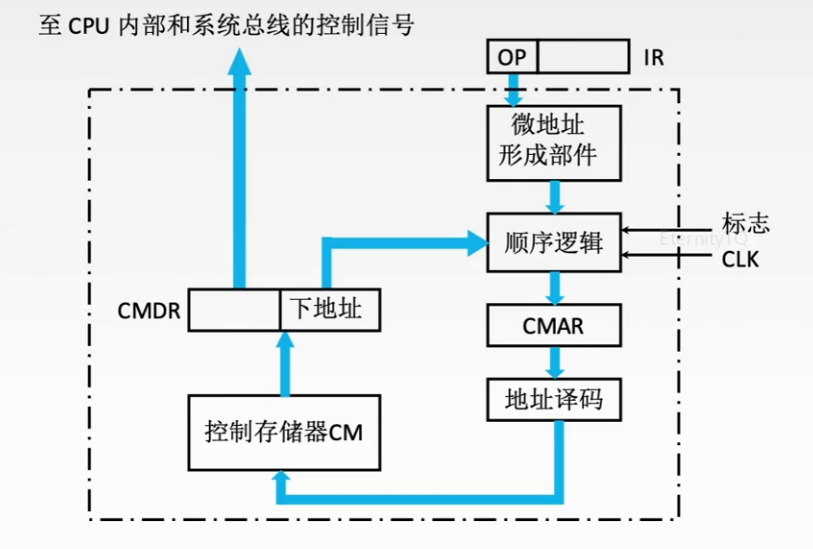
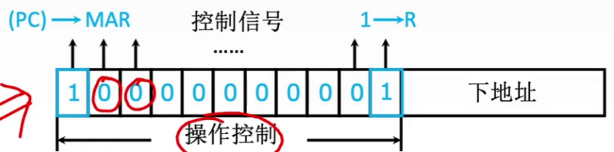

## 1. 硬布线控制器

根据操作指令码、目前的机器周期、节拍信号、机器状态条件，即可确定现在这个节拍下应该发出哪些"微命令"

指令操作码来源：指令码译码器，由IR输入

机器周期：四个触发器，集成在CU内部

节拍信号：节拍发生器接入，每个时钟周期发出一个节拍信号

机器状态条件：来自执行单元的反馈信息，可能来自PSW、ACC的符号位；也可能来自IO设备、主存

设计步骤：

1. 分析每个阶段的微操作序列
2. 选择CPU的控制方式
3. 安排微操作时序
4. 电路设计
    - 列出操作时间表
    - 列出微操作命令的最简表达式
    - 画出逻辑图

安排微操作时序的原则：

1. 微操作的先后顺序不得随意更改
2. 被控对象不同的微操作，尽量安排在一个节拍内完成
3. 占用时间较短的微操作，尽量安排在一个节拍内完成，并允许有先后顺序

特点：指令越多，设计和实现就越复杂，因此一般用于RISC

如果扩充新指令，则设计就需要大改，因此扩充指令较困难

由于使用纯硬件实现控制，因此实现速度很快。

微操作控制信号由组合逻辑电路即时产生

## 2. 微程序控制器

考察频率更高

采用“存储程序”的思想，CPU出场前将所有指令的微程序存入控制器存储器中

微程序的设计思想就是将没调机器指令编写为一个微程序，每个微程序包含若干微指令，每个微指令包含一个或多个微操作命令

==因此，执行一条指令的过程就是执行一个微程序的过程==

微命令和微操作一一对应

微程序：由微指令序列组成，每一种指令对应一个微程序

指令：对程序执行步骤的描述

微指令：对指令执行步骤的描述

指令是对微指令功能的封装

### 2.1 微程序控制器的基本结构

+ 控制存储器：CM，CM由ROM构成，公共的取指微程序段

+ CMAR：别名：μPC，微地址寄存器，接受微地址形成部件送来的微地址，为在CM中读取微指令做准备

+ CMDR：别名：μIR，用于存放从CM中取出的微指令

+ 微地址形成部件：产生初始微地址和后续微地址，保证微指令的连续执行

+ 地址译码器：将CMAR内的地址信息译码为电信号，控制CM读出微指令

控制器会根据指令地址码的寻址特征为来判断是否要跳过间址周期

处理取指周期、间址周期、中断周期的微指令序列通常是公用的；执行周期的微指令序列各不相同

取值周期的微指令序列固定从#0开始存放，执行周期的微指令序列的存放根据指令操作码来决定

## 3. 微指令的设计

相容性微命令：可以并行完成的微命令

互斥性微命令：不允许并行完成的微命令

垂直型微指令：一条微指令只能定义一个微命令，由微操作码字段规定具体功能

优点：微指令短，简单规整，便于编写微程序

缺点：微程序长，执行速度慢，工作效率低

混合型微指令：在垂直型的基础上增加一些不太复杂的并行操作

微指令较短，仍便于编写；微程序也不长，执行速度加快

### 3.1 水平型微指令

水平型微命令：一条微指令能定义多个可并行的微命令

优点：微程序短(条数不多)，执行速度快

缺点：微指令长，编写微程序较麻烦

#### 3.1.1 直接编码方式

在微指令的操作控制字段中，每一位代表一个微操作命令

某位为1，表示该控制信号有效

优点：简单，直观，执行速度快，操作并行性好

缺点：微指令字长过长，n个微命令就要求微指令的操作字段有n位，造成控存容量极大

#### 3.1.2 字段直接编码

将微指令的控制字段分为若干"段"，每段经译码后发出控制信号

每段同时只能同时发出一个微命令

分段原则：

1. 互斥性微命令分在同一段内，相容性微命令分在不同段内

2. 每个小段中包含的信息位不能太多，否则将增加译码线路的复杂性和译码时间

3. 一般每个小段还有留出一个状态位，表示本字段不发出任何微命令。

例如，当某字段长度为3位时，最多只能表示7个互斥的微命令，通常用全0表示不操作

优点：可以缩短微指令字长

缺点：要经过译码电路后再发出，比直接编码方式慢

#### 3.1.3 字段间接编码

一个字段的某些微命令，需要由另一个字段的某些微命令来解释，又称为隐式编码

优点：进一步缩短微指令字长

缺点：削弱了微指令的并行控制能力

故通常作为字段直接编码方式的一种辅助手段

### 3.2 地址形成方式

1. 微指令的下地址字段指出，由微指令的后继地址字段直接指出后继微指令的地址，也称为断定方式

2. 根据机器指令的操作码形成

3. 增量计数器法，类似PC，μPC+1

4. 分支转移

5. 通过测试网络

6. 由硬件产生微程序入口地址

## 4. 微程序控制单元的设计

1. 分析每个阶段的微操作序列
2. 写出对应机器指令的微操作命令及节拍安排
 - 写出每个周期所需要的微操作(参考硬布线)
 - 补充微程序控制器特有的微操作：
   - a. 取指周期：

     Ad(CMDR)→CMAR

     OP(IR)→微地址形成部件→CMAR
   - b. 执行周期：

     Ad(CMDR)
3. 确定微指令格式

根据微操作的个数决定采用何种编码方式，以确定微指令的操作控制字段的位数。

4. 编写微指令码点

## 5. 微程序和硬布线的比较

| 对比项目 | 微程序控制器 | 硬布线控制器 |
| --- | --- | --- |
| 工作原理 | 微操作控制信号以微程序的形式存放在控制存储器中，执行指令时读出即可 | 以纯硬件的思想实现，由组合逻辑电路根据当前的指令码、状态和时序即时产生 |
| 执行速度 | 慢 | 快 |
| 规整性 | 较规整 | 繁琐、不规整 |
| 应用场合 | CISC CPU | RISC CPU |
| 易扩充性 | 易扩充修改 | 困难 |

